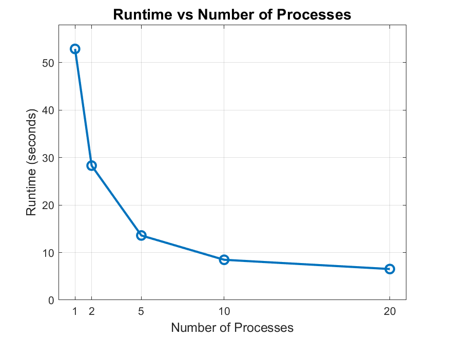

# System Programming Lab 11 Multiprocessing

## Overview
Lab 11 implements a program, mandelmovie, that generates a movie by "zooming in" on the Mandelbrot set. It uses multiprocessing to optimize the rendering of individual frames and integrates ffmpeg to stitch the frames into a movie. The mandel program provided computes individual Mandelbrot set images.

For lab 11, the program, mandelmovie, invokes mandel 50 times and vary parameters slightly with each new image to “fly” into the Mandelbrot set. This program, mandelmovie, accepts at one command line argument for the number of processes used to calculate the frames. A movie is then generated by "zooming in" on the Mandelbrot set. 

## Instructions to Run
#### Compile the Code:
- make clean
- make
#### Run mandelmovie:
- ./mandelmovie -p <process_count>
#### Watch movie:
ffplay mandelmovie.mpg
Remove compiled files and images:
- make clean
- rm mandel*.jpg

## Runtime Results
#### Graph of Runtime Results

The graph shows the runtime to generate 100 frames of the Mandelbrot set versus different numbers of child processes.

## Discussion of Results
The runtime results as shown in the graph above, show a significant decrease in execution time as the number of processes increase. When using fork() to create child processes, it enabled parallel execution of tasks. When multiple child processes are created the parent delegates image generation tasks to the children, allowing simultaneous execution which then decreases reducing overall runtime.
Too many child processes though, start to cause overhead. This is proven as the graph shows that the reduction in runtime slows down because the slope decreases. 
