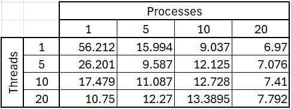

# System Programming Lab 12 Multithreading

## Overview
Lab 12 uses code from Lab11 which implements a program, mandelmovie, that generates a movie by "zooming in" on the Mandelbrot set. It uses multiprocessing to optimize the rendering of individual frames and integrates ffmpeg to stitch the frames into a movie. The mandel program provided computes individual Mandelbrot set images.

For lab 1, the program, mandelmovie, invokes mandel 50 times and vary parameters slightly with each new image to “fly” into the Mandelbrot set. This program, mandelmovie, accepts at one command line argument for the number of processes used to calculate the frames. A movie is then generated by "zooming in" on the Mandelbrot set. 

## Instructions to Run
#### Compile the Code:
- make clean
- make
#### Run mandelmovie:
- ./mandelmovie -p <process_count>
    or
- ./mandelmovie -p <process_count> -t <thread_count>
#### Watch movie:
ffplay mandelmovie.mpg
Remove compiled files and images:
- make clean
- rm mandel*.jpg

## Results
#### Table of Benchmarking Results

Looking at the table, multiprocessing seemed to have a greater impact on runtime compared to multithreading. As the number of processes increase from 1 to 20 (with 1 thread) the runtime was reduced greatly from 56.212 seconds to 6.970 seconds. This makes sense because each process runs independently on separate cores, reducing contention and maximizing CPU usage. Multithreading was the most effective when the thread count was close to the number of cores my computer has (12 cores). For most part, multithreading showed diminishing returns as the number of threads increased beyond the 12 CPU cores because it can cause overhead from thread management and context switching. The "sweet spot" for minimal runtime was 6.970 seconds with 20 processes and 1 thread.
#### Graph of Runtime Results

The graph shows the runtime to generate 100 frames of the Mandelbrot set versus different numbers of child processes.

## Discussion of Results
The runtime results as shown in the graph above, show a significant decrease in execution time as the number of processes increase. When using fork() to create child processes, it enabled parallel execution of tasks. When multiple child processes are created the parent delegates image generation tasks to the children, allowing simultaneous execution which then decreases reducing overall runtime.
Too many child processes though, start to cause overhead. This is proven as the graph shows that the reduction in runtime slows down because the slope decreases. 
